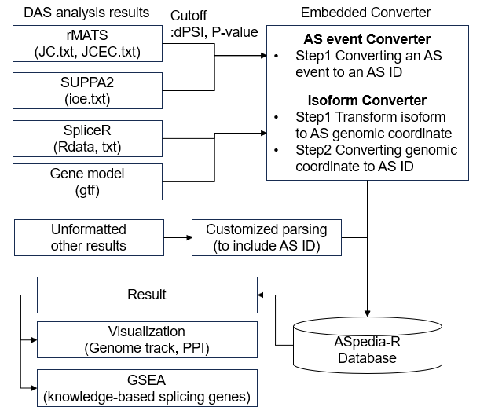
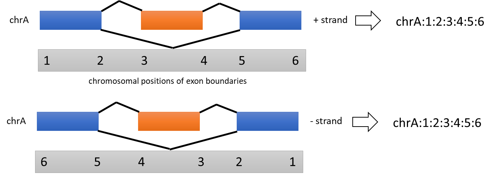

<!-- README.md is generated from README.Rmd. Please edit that file -->

# ASpediaR

<!-- badges: start -->
<!-- badges: end -->

ASpedia-R is an application to explore the comprehensive multi-omics profile of human splicing event regions. Our database covers various sequence features encompassing DNA, RNA, and protein located in spliced exonic regions. To interrogate sequence features existing around splicing events, our package provides the retrieval system to search sequence features from AS event profile. 

Our package has the convenience to explore the sequence profile from differential alternative splicing (AS) analysis results to detect the number of AS candidates. Especially, our package embedded the converter for three representative DAS programs rMATS, SUPPA, and spliceR. Furthermore, the user could easily generate ASpedia-R input format to follow splicing ID rule.

## Workflow Summary
```{r, echo=FALSE, fig.align="center", fig.cap=""}

```

Our application operates to follow these steps.

  1. To prepare an input file (differential AS analysis result) to include the profile of multiple AS events (the genomic coordinates of exon regions).
  2. To convert an input file to using our splice ID format.
      2-1. To convert unformatted other results, the user should generate AS event IDs to follow our AS event ID rule. User guide document presented code example.

```{r, echo=FALSE, fig.align="center", fig.cap="", out.width="70%"}

```

  3. To annotate multi-omics profile via querying AS events.
  4. To visualize the result for each AS event or to perform AS gene set enrichment analysis referring our knowledge-based database (Computational and Structural Biotechnology Journal 2023 [doi: 10.1016/j.csbj.2023.02.052](https://doi.org/10.1016/j.csbj.2023.02.052)).

## Usage

ASpedia-R is an R package to require installation, and simply executable to proceed several steps. Specific usage is described in our user guide document.

## Support

For further information or help, don’t hesitate to get in touch on our team ([Daijin Hyung](mailto:daejin0709@ncc.re.kr), [Charny Park](mailto:charn78@ncc.re.kr)).

## Citation
Original and updated database of this application was published in Nucleic Acids Research 2017 doi: [10.1093/nar/gkx1014](https://doi.org/10.1093/nar/gkx1014), and Computational and Structural Biotechnology Journal 2023 doi: [10.1016/j.csbj.2023.02.052](https://doi.org/10.1016/j.csbj.2023.02.052).

This application is preparing the publication.